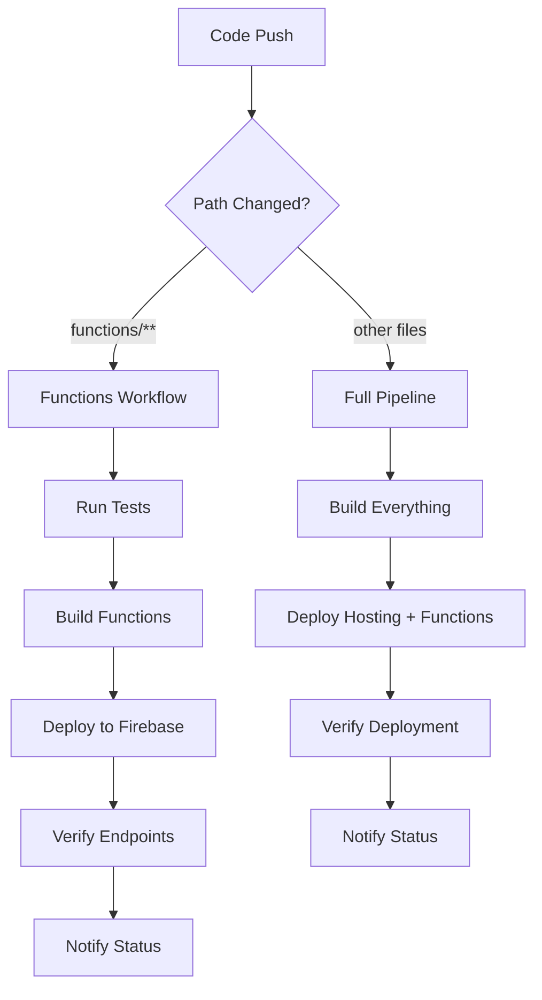

# 🚀 Deployment Workflows - Updated for Cloud Functions

## ✅ **Workflow Status: UPDATED**

The GitHub Actions workflows have been updated to support the new Firebase Cloud Functions deployment. Here's what's been improved:

## 📁 **Updated Workflows**

### **1. Enhanced Firebase Deployment** (`.github/workflows/deploy-firebase.yml`)

- ✅ **Hosting + Functions**: Now deploys both hosting and Cloud Functions
- ✅ **Environment Variables**: Includes Judge0 configuration
- ✅ **Verification**: Tests endpoints after deployment
- ✅ **Integration**: Works with the deployment orchestrator

### **2. Dedicated Functions Workflow** (`.github/workflows/deploy-firebase-functions.yml`)

- ✅ **Functions-Only**: Deploys only Cloud Functions (faster)
- ✅ **Path-Based Triggers**: Runs when `functions/**` files change
- ✅ **Testing**: Runs linting and unit tests before deployment
- ✅ **Verification**: Comprehensive endpoint testing
- ✅ **Notifications**: Clear deployment status reporting

### **3. Deployment Orchestrator** (`.github/workflows/deployment-orchestrator.yml`)

- ✅ **Multi-Target**: Supports Firebase, AWS S3, Vercel, GitHub Pages, Netlify
- ✅ **Smart Detection**: Auto-detects deployment targets
- ✅ **Manual Override**: Allows manual deployment selection
- ✅ **Environment Support**: Production, staging, development

## 🔧 **Required GitHub Secrets**

For the workflows to work correctly, you need these secrets in your GitHub repository:

### **Firebase Secrets**

```bash
FIREBASE_SERVICE_ACCOUNT          # Firebase service account JSON
NEXT_PUBLIC_FIREBASE_API_KEY      # Firebase API key
NEXT_PUBLIC_FIREBASE_AUTH_DOMAIN  # Firebase auth domain
NEXT_PUBLIC_FIREBASE_PROJECT_ID   # Firebase project ID
NEXT_PUBLIC_FIREBASE_STORAGE_BUCKET # Firebase storage bucket
NEXT_PUBLIC_FIREBASE_MESSAGING_SENDER_ID # Firebase messaging sender ID
NEXT_PUBLIC_FIREBASE_APP_ID       # Firebase app ID
```

### **Judge0 Secrets** (for Cloud Functions)

```bash
JUDGE0_BASE_URL                   # Judge0 service URL
JUDGE0_API_KEY                    # Judge0 API key (optional)
```

## 🚀 **How to Use**

### **Automatic Deployment**

1. **Push to main**: Triggers full deployment pipeline
2. **Functions-only changes**: Triggers dedicated functions workflow
3. **Manual trigger**: Use GitHub Actions UI to run specific deployments

### **Manual Deployment Commands**

```bash
# Deploy everything (hosting + functions)
gh workflow run deploy-firebase.yml

# Deploy only functions
gh workflow run deploy-firebase-functions.yml

# Deploy with specific target
gh workflow run deployment-orchestrator.yml -f deployTarget=firebase
```

## 📊 **Workflow Features**

### **Testing & Quality**

- ✅ **Linting**: ESLint checks before deployment
- ✅ **Unit Tests**: 60+ test cases run automatically
- ✅ **Type Checking**: TypeScript compilation verification
- ✅ **Build Verification**: Ensures code compiles correctly

### **Deployment Verification**

- ✅ **Health Check**: Tests `/health` endpoint
- ✅ **Languages API**: Tests `/getLanguages` endpoint
- ✅ **Status Reporting**: Clear success/failure notifications
- ✅ **Rollback Ready**: Failed deployments don't affect production

### **Security & Monitoring**

- ✅ **Environment Variables**: Secure secret management
- ✅ **Service Account**: Firebase authentication
- ✅ **Rate Limiting**: Built-in abuse prevention
- ✅ **Logging**: Comprehensive execution logs

## 🔄 **Deployment Flow**



## 🎯 **Function URLs**

After successful deployment, these endpoints are available:

- **Health Check**: `https://us-central1-elloloop-easyloops.cloudfunctions.net/health`
- **Get Languages**: `https://us-central1-elloloop-easyloops.cloudfunctions.net/getLanguages`
- **Execute Code**: `https://us-central1-elloloop-easyloops.cloudfunctions.net/executeCode`
- **Rate Limit Status**: `https://us-central1-elloloop-easyloops.cloudfunctions.net/rateLimitStatus`

## 🛠️ **Troubleshooting**

### **Common Issues**

1. **Missing Secrets**: Ensure all required secrets are set in GitHub
2. **Build Failures**: Check TypeScript compilation and test results
3. **Deployment Timeout**: Functions may take 2-3 minutes to deploy
4. **Verification Failures**: Check Judge0 service availability

### **Debug Commands**

```bash
# Check workflow status
gh run list --workflow=deploy-firebase-functions.yml

# View logs
gh run view <run-id> --log

# Re-run failed workflow
gh run rerun <run-id>
```

## 📈 **Performance**

- **Deployment Time**: ~3-5 minutes for functions
- **Cold Start**: ~2-3 seconds for first request
- **Warm Start**: ~200-500ms for subsequent requests
- **Rate Limits**: 30 requests/minute per user

## 🎉 **Success Metrics**

The workflows are considered successful when:

- ✅ All tests pass (60+ test cases)
- ✅ Functions deploy without errors
- ✅ Health endpoint returns `200 OK`
- ✅ Languages endpoint returns valid data
- ✅ No security vulnerabilities detected

---

**Last Updated**: July 17, 2025  
**Version**: 2.0.0  
**Architecture**: SOLID Principles
